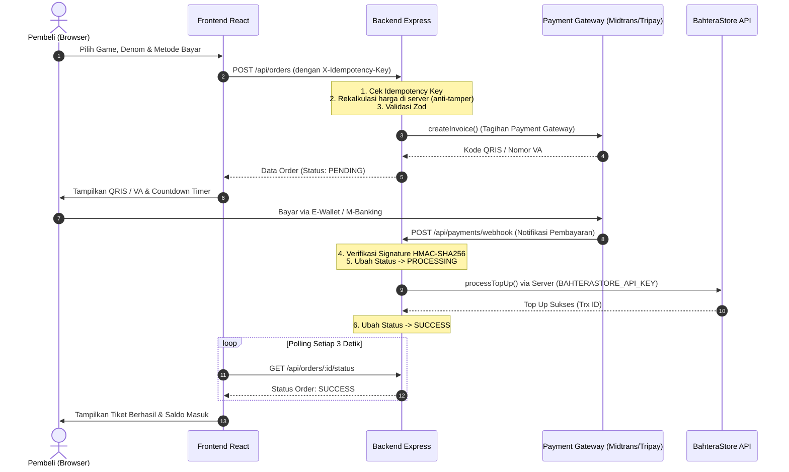

# 🎮 MAID GAMING - Modern Top Up Game Platform (Full-Stack Architecture)

Website top up game modern bertema dark gaming dengan aksen neon gradient ungu ke biru (*neon purple to blue*), efek subtle glow pada card dan tombol, sentuhan glassmorphism, tipografi premium (Sora / Poppins & Inter), responsif penuh, serta arsitektur backend terpisah yang aman untuk mengisolasi API key provider.

---

## 🔒 Arsitektur Keamanan (Full-Stack Decoupling)

Sistem telah direfaktor menjadi arsitektur backend dan frontend yang terpisah:
1. **Backend (Node.js & Express - `backend/`)**:
   - **Satu-satunya pihak** yang menyimpan dan menggunakan `BAHTERASTORE_API_KEY`.
   - Mengisolasi pemanggilan API BahteraStore dari publik dan browser client.
   - Menyediakan abstraksi generik Payment Gateway (Midtrans / Xendit / Tripay) dengan fungsi `createInvoice()` dan `verifyWebhookSignature()`.
   - Menghitung ulang harga di server untuk mencegah manipulasi harga dari client browser.
   - Proteksi keamanan: **Rate Limiting** (`express-rate-limit`), validasi input schema (**Zod**), dan **Idempotency Key** untuk mencegah order ganda.
2. **Frontend (React + Vite - `src/`)**:
   - 100% bersih dari API Key BahteraStore dan tidak memanggil API BahteraStore secara langsung.
   - Seluruh request dialihkan ke backend internal (`/api/games`, `/api/orders`, `/api/orders/:id/status`).
   - Tampilan visual, dark theme neon ungu-biru, animasi glow, dan pengalaman pengguna tetap dipertahankan sepenuhnya.

---

## 📁 Struktur Direktori Full-Stack

```plaintext
TOPUP/
├── .env                  # Environment frontend (hanya berisi VITE_API_BASE_URL)
├── .env.example          # Template frontend
├── package.json          # Frontend dependencies
├── vite.config.js
├── index.html
├── src/                  # Frontend React (UI, Pages, Components, Hooks)
└── backend/              # BACKEND BARU (Node.js + Express)
    ├── .env              # Kredensial rahasia (BAHTERASTORE_API_KEY, PAYMENT_GATEWAY, JWT)
    ├── .env.example      # Template aman backend
    ├── package.json      # Backend dependencies (express, zod, axios, cors, rate-limit)
    ├── server.js         # Entry point Express API (Port 5000)
    ├── config/
    │   └── index.js      # Konfigurasi terpusat
    ├── middlewares/
    │   ├── rateLimiter.js        # Proteksi rate limit request
    │   ├── validateMiddleware.js  # Validasi input skema Zod
    │   ├── errorHandler.js       # Centralized error handler
    │   └── authMiddleware.js     # Autentikasi JWT Super Admin
    ├── services/
    │   ├── bahteraStoreService.js # Satu-satunya pemanggil API BahteraStore
    │   └── paymentService.js      # Abstraksi Midtrans/Xendit/Tripay & Webhook HMAC
    ├── controllers/
    │   ├── gameController.js      # Handler katalog & cek nickname
    │   ├── orderController.js     # Validasi harga server, idempotency, & order status
    │   └── paymentController.js   # Verifikasi webhook gateway & eksekusi topup
    └── routes/
        ├── gameRoutes.js          # /api/games
        ├── orderRoutes.js         # /api/orders
        └── paymentRoutes.js       # /api/payments/webhook
```

---

## ⚙️ Panduan Menjalankan Project

### 1. Menjalankan Backend Server (Port 5000)
Buka terminal baru di folder `TOPUP/backend`:
```bash
cd backend
npm install
npm start
```
Server backend akan aktif di `http://localhost:5000` dengan endpoint:
- Health Check: `GET http://localhost:5000/api/health`
- Katalog Game: `GET http://localhost:5000/api/games`
- Pembuatan Order: `POST http://localhost:5000/api/orders`
- Status Order: `GET http://localhost:5000/api/orders/:id/status`
- Payment Webhook: `POST http://localhost:5000/api/payments/webhook`

### 2. Menjalankan Frontend React (Port 5173)
Buka terminal di root folder `TOPUP`:
```bash
npm install
npm run dev
```
Buka browser di `http://localhost:5173`.

---

## 🔑 Konfigurasi Environment Variables

### 1. Backend (`backend/.env`):
```env
PORT=5000
NODE_ENV=development
BAHTERASTORE_BASE_URL=https://api.bahterastore.id/
BAHTERASTORE_API_KEY=your_bahterastore_api_key_here
PAYMENT_GATEWAY_KEY=
PAYMENT_GATEWAY_SECRET=
JWT_SECRET=super_secret_jwt_key_maid_topup_2026
CLIENT_URL=http://localhost:5173
```

### 2. Frontend (`.env`):
```env
VITE_API_BASE_URL=http://localhost:5000/api
```

---

## 🛡️ Alur Transaksi Aman



---

© 2026 Maid Gaming Top Up. All rights reserved.
